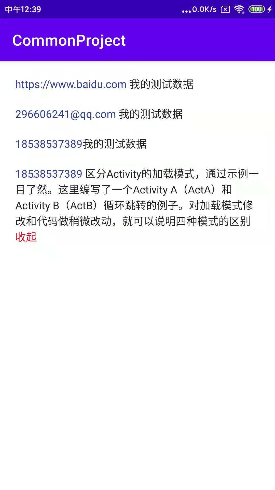

## 介绍

自定义TextView 实现高亮显示手机号,邮箱,网址 以及实现可扩展收起的TextView

* AutoLinkTextView 支持手机号,邮箱,网址自定义高亮颜色展示
* ExpandableTextView 可扩展的TextView
 
#### 引用

implementation 'com.github.wukuiqing49:CommonProject:v1.0.4'

#### 效果
<p>


</p>

#### 功能

* 手机号
* 邮箱
* 网址
* 扩展显示
* 跳转拨号,网址,发送邮件
* 支持长按复制

#### 使用

##### 1.展示邮箱,手机号,网址
```
 <com.wu.view.AutoLinkTextView 
   android:layout_marginRight="20dp"  
   android:layout_marginLeft="20dp"  
   android:layout_width="match_parent"  
   android:layout_height="wrap_content"  
   app:useLongClick="true"/>   
```
##### 2.可扩展的TextView
```
<com.wu.view.ExpandableTextView
        android:layout_marginTop="20dp"
        android:layout_marginRight="20dp"
        android:layout_marginLeft="20dp"
        android:layout_width="match_parent"
        app:maxCollapsedLength="40"
        app:new_collapseHint="收起"
        app:new_expandHint="全文"
        app:new_hintColor="@color/color_m_red"
        android:layout_height="wrap_content"
        android:text="18538537389 区分Activity的加载模式，通过示例一目了然。这里编写了一个Activity A（ActA）和Activity B（ActB）循环跳转的例子。"
        tools:ignore="MissingConstraints" />  
```

#### 方法介绍

* OnAutoLinkClickListener 链接点击事件
* OnAutoLinkLongClickListener 长按事件
* linkTextColor 高亮展示颜色
* new_hintColor 扩展(全部/收起) 展示的颜色
* new_expandHint 全部文字的自定义属性
* new_collapseHint 收起文字的自定义属性


 
 

 


